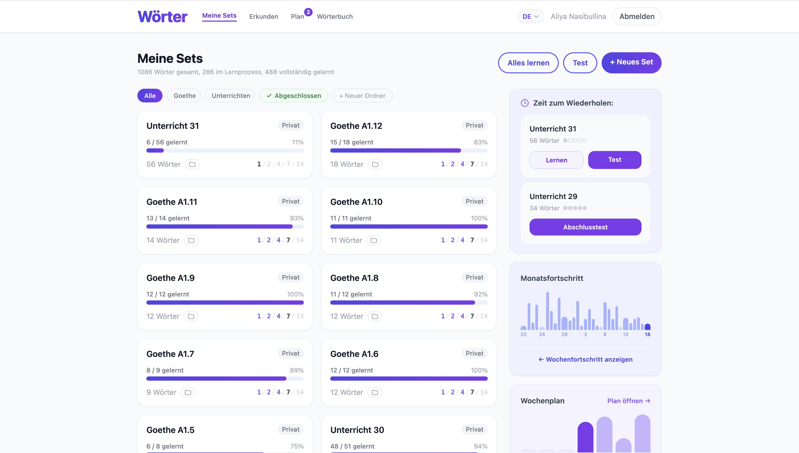
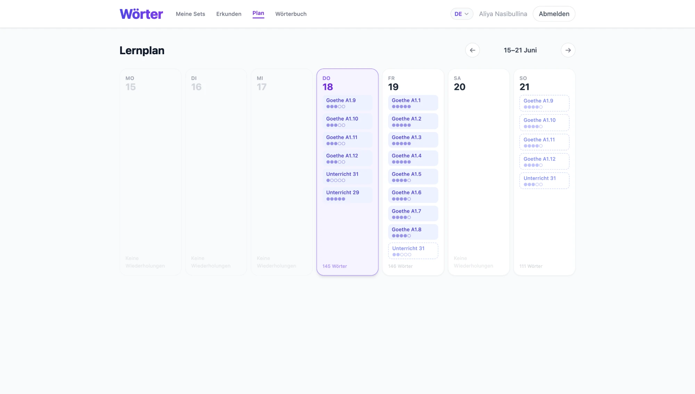

# Wörter — Vocabulary Learning App

I built this app to learn German vocabulary while preparing to relocate to Germany. Existing flashcard tools didn't fit how I wanted to study, so I wrote my own — with a spaced repetition algorithm, a structured review schedule, and a quiz mode that actually tests whether you can recall the word from scratch, not just recognize it.

**Backend:** C# · ASP.NET Core 8 · Entity Framework Core 8 · PostgreSQL  
**Frontend:** React 18 · TypeScript · Tailwind CSS  
**Auth:** Google OAuth 2.0 → JWT  
**Infra:** Docker Compose · Vercel · Render · Neon

---

## Screenshots

| My Sets | Weekly Plan |
|---|---|
|  |  |

---

## What it does

- **Word sets** — create, edit, bulk-import (`term - definition` format), make public or private
- **Two study modes** — flip-card flashcards and a two-phase quiz (multiple choice → typed answer)
- **Spaced repetition** — custom 5-stage SRS; intervals calculated from the actual study date so a missed day shifts the schedule forward, not backwards
- **Final stage** — stage 5 requires a perfect written test; each word is tracked individually so partial progress is saved between attempts
- **Weekly plan** — calendar view of upcoming reviews with drag-and-drop rescheduling
- **Activity charts** — daily word count bar charts (week and 30-day views)
- **Explore** — search and save public sets from other users
- **Dictionary** — search all your words across all sets; filter by completion
- **Folders** — organize sets into named groups (works for both owned and saved sets)
- **Text-to-speech** — pronounce words using the browser's Web Speech API with the set's BCP-47 language tag
- **Multilingual UI** — Russian, English, German

---

## Backend highlights

### REST API — 10 controllers, ~35 endpoints

```
POST   /api/auth/google          Google ID token → JWT
GET    /api/sets                 All user's sets (owned + saved) with progress summary
POST   /api/sets                 Create set
GET    /api/sets/{id}            Set detail with words and SRS progress
PUT    /api/sets/{id}            Update set
DELETE /api/sets/{id}            Delete set
POST   /api/sets/{id}/clone      Save a public set to your collection
DELETE /api/sets/{id}/clone      Remove a saved set
POST   /api/sets/{id}/words      Bulk add words
PUT    /api/words/{id}           Update word
DELETE /api/words/{id}           Delete word
POST   /api/progress/{setId}     Record study session → updates SRS state
GET    /api/progress/{setId}     Get progress + per-word stats
GET    /api/progress/weekly      Words studied per day (Mon–Sun)
GET    /api/progress/monthly     Words studied per day (last 30 days)
GET    /api/progress/weakest-words  Ranked list of weakest words across sets
GET    /api/plan/weekly          Review schedule for the week
GET    /api/plan/monthly         Review schedule for 30 days
PATCH  /api/plan/{setId}/reschedule  Move a review to a different day
GET    /api/reminders            Sets due for review today
GET    /api/folders              List user's folders
POST   /api/folders              Create folder
PUT    /api/folders/{id}         Rename folder
DELETE /api/folders/{id}         Delete folder (sets keep their data)
PATCH  /api/folders/{id}/sets/{setId}  Assign set to folder
GET    /api/explore              Search public sets (paginated)
GET    /api/dictionary           Search all words with filter
```

### Entity Framework Core 8 + PostgreSQL

9 tables, 14 EF-generated migrations, applied automatically on startup.

Key schema decisions:
- `SetProgress(UserId, SetId)` — unique composite index; composite index on `(UserId, NextReviewAt)` for fast "what's due today" queries
- `WordProgress.IsFinalCompleted` — tracks which words have passed the final written test
- `SetStudyLog` — append-only audit log, one row per session
- `UserSet.FolderId` — per-user folder assignment for saved (public) sets, separate from the owner's folder

```csharp
// Automatic migration on startup
using (var scope = app.Services.CreateScope())
{
    var db = scope.ServiceProvider.GetRequiredService<AppDbContext>();
    db.Database.Migrate();
}
```

### Spaced repetition algorithm

Custom SRS implemented in [`ReviewScheduler.cs`](backend/VocabApp.API/Services/ReviewScheduler.cs) — a pure static class with no database dependencies, making it fully unit-testable.

```csharp
public static readonly int[] Intervals = [1, 1, 2, 3, 7]; // days per stage

public static bool RecordReview(SetProgress progress, int knownCount, int totalWords)
{
    // Only advance when the scheduled day has arrived
    if (!progress.NextReviewAt.HasValue || progress.NextReviewAt.Value.Date > DateTime.UtcNow.Date)
        return false;

    // Final stage: perfect score required
    if (progress.ReviewStage == FinalStage && knownCount < totalWords)
        return false;

    progress.ReviewStage = Math.Min(progress.ReviewStage + 1, Intervals.Length + 1);

    // Relative to today — a missed day shifts the whole schedule forward
    progress.NextReviewAt = progress.ReviewStage <= Intervals.Length
        ? DateTime.UtcNow.Date.AddDays(Intervals[progress.ReviewStage - 1])
        : null; // stage 6 = complete
    return true;
}
```

43 xUnit tests cover the full scheduling logic including grace period expiry, missed days, and final-stage edge cases.

| Stage | Next review | Notes |
|---|---|---|
| 1 | +1 day | |
| 2 | +1 day | |
| 3 | +2 days | |
| 4 | +3 days | |
| 5 | — | Perfect score required; word-by-word completion tracked |
| 6 | Complete | `NextReviewAt = null` |

Grace period: if a review is missed by more than 3 days the cycle resets to stage 0. Final stage is exempt — it can be attempted any time.

---

## Quick start

```bash
git clone <repo-url>
cd vocab-app
cp .env.example .env
# Set GOOGLE_CLIENT_ID in .env (see Configuration below)

docker compose up --build
```

| Service   | URL |
|---|---|
| Frontend  | http://localhost:5173 |
| API       | http://localhost:5050 |
| Swagger   | http://localhost:5050/swagger |
| Database  | localhost:5433 |

The frontend source is mounted as a volume — Vite hot-reloads on file changes without rebuilding the container.

---

## Running tests

```bash
# Backend — 43 xUnit tests
cd backend && dotnet test

# Frontend — Vitest
cd frontend && npm test
```

---

## Project structure

```
vocab-app/
├── backend/
│   ├── VocabApp.API/
│   │   ├── Controllers/     # 10 REST controllers
│   │   ├── Data/
│   │   │   ├── AppDbContext.cs
│   │   │   └── Migrations/  # 14 EF-generated migrations
│   │   ├── DTOs/            # C# records for requests/responses
│   │   ├── Models/          # 9 EF entity classes
│   │   ├── Services/
│   │   │   ├── ReviewScheduler.cs   # SRS algorithm
│   │   │   ├── AuthService.cs       # Google OAuth + JWT
│   │   │   └── GeminiService.cs     # Groq API client
│   │   └── Program.cs
│   ├── VocabApp.Tests/      # xUnit — ReviewScheduler tests
│   └── Dockerfile
├── frontend/
│   ├── src/
│   │   ├── api/             # Typed Axios API modules
│   │   ├── components/      # TestRunner, QuizRunner, NextSetButton, …
│   │   ├── context/         # Auth, i18n, Toast
│   │   ├── pages/           # 14 route-level pages
│   │   └── utils/           # testEngine, importParser, speech, srs
│   ├── Dockerfile           # Dev (Vite)
│   └── Dockerfile.prod      # Production (nginx)
├── docker-compose.yml       # Local development
├── docker-compose.prod.yml  # Self-hosted production
└── .env.example
```

---

## Configuration

Copy `.env.example` to `.env` and fill in:

| Variable | Description |
|---|---|
| `GOOGLE_CLIENT_ID` | Google OAuth 2.0 Client ID — [create one here](https://console.cloud.google.com) |
| `JWT_SECRET` | Random string ≥ 32 chars — `openssl rand -base64 32` |

Additional backend variables (Render / production):

| Variable | Description |
|---|---|
| `ConnectionStrings__Default` | PostgreSQL connection string |
| `Frontend__Url` | Frontend origin for CORS |
| `ASPNETCORE_ENVIRONMENT` | `Production` |
| `Groq__ApiKey` | Optional — Groq API key for example-sentence generation |

---

## Deployment

Full guide: [DEPLOY.md](DEPLOY.md)

**Free tier:** Vercel (frontend) + Render (backend) + Neon (PostgreSQL)  
**Self-hosted:** `docker compose -f docker-compose.prod.yml up -d --build`

---

## Docs

- [ARCHITECTURE.md](ARCHITECTURE.md) — backend/frontend architecture, auth flow, data flow
- [DATABASE.md](DATABASE.md) — full schema: tables, columns, constraints, indexes, migrations
- [DEPLOY.md](DEPLOY.md) — deployment guide for all three options
